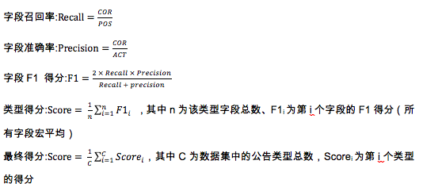

# 赛题说明

#### 赛题描述

在投资研究过程中，上市公司公告是投资者的重要参考材料，挖掘公告重要信息是研究员每日的必要功课，但海量公告却令人脑难以负荷。如果机器能够根据需求，自动抽取结构化数据，就能帮助研究员快速获取投资线索。

#### 相关名词解释 
【信息披露（公告）】主要是指公众公司以招股说明书、上市公告书以及定期报告和临时报告等形式，把公司及与公司相关的信息，向投资者和社会公众公开披露的行为。目前，上市公司所发布的公告，是投资者及社会公众了解企业情况，进行投资决策的基本依据。  
【股东增减持】由于上市公司股东、高管相较社会公众更加了解公司的发展状况，因此投资者会格外关注重要股东的买卖行为，并以此作为投资参考。比如：
“股东增持行为”通常表示公司股东对公司营收及发展前景有信心，投资者会跟随追捧，有利于提升公司股价； 
“股东减持行为”除股东个人原因外，也可能表示股东对公司发展信心不足，这会给投资者带来一定负面影响，导致投资者抛售股票，公司股价下跌。
【定向增发】上市公司定向增发的主要目是通过融资扩张公司业务和规模，例如发起新项目，研发新技术，收购其他公司等。投资者可以通过定增目的了解公司的融资意图，从而判断公司前景以及投资价值。
【重大合同】上市公司签署重大合同，有利于增加公司营业收入，投资者通过了解合同项目金额，可进一步预测公司未来的经营和业绩情况，从而发掘投资机会。

#### 数据来源
上交所、深交所发布的公告数据和通联数据特有的结构化数据。

#### 数据说明
本次比赛将提供3种类型的数据： 
1、原始公告pdf，以{公告id}.pdf命名； 
2、公告pdf转换的html文件，以{公告id}.html命名； 
3、公告对应的结构化数据，以表格的格式给出，每种公告类型提供一份数据，每篇公告可能会对应多条数据，格式说明如下：

| 公告类型   | 主键  | 第1列  | 第2列    | 第3列    | 第4列        | 第5列        | 第6列        | 第7列        | 第8列          |
| ---------- | ----- | ------ | -------- | -------- | ------------ | ------------ | ------------ | ------------ | -------------- |
| 股东增减持 | 1-2-4 | 公告id | 股东全称 | 股东简称 | 变动截止日期 | 变动价格     | 变动数量     | 变动后持股数 | 变动后持股比例 |
| 重大合同   | 1-2-3 | 公告id | 甲方     | 乙方     | 项目名称     | 合同名称     | 合同金额上限 | 合同金额下限 | 联合体成员     |
| 资产重组也 | 1-2-3 | 公告id | 交易标的 | 标的公司 | 交易对方     | 交易标的作价 | 评估方法     |              |                |
| ~~定向增发~~   | ~~1-2~~   | ~~公告id~~ | ~~增发对象~~ | ~~增发数量~~ | ~~增发金额~~     | ~~锁定期~~       | ~~认购方式~~  |              |                |

**复赛考察股东增减持、重大合同、资产重组3种公告类型，去掉定向增发类型，股东增减持和重大合同按照测试集B的结果提交。**

#### 提交说明
1、测试数据包括原始公告pdf、对应的html文件以及这些公告的类型，选手需要利用这些数据、生成符合上述数据格式的结构化数据；

2、需要注意的是，不同类型的数据会有若干字段组成联合主键，如果联合主键中的字段抽取错误，则认为整条数据错误。

3、提交格式请参考submit_sample.zip中的格式，以 utf-8(without BOM) 为编码格式，以tab分隔的三个txt文件，不要改变文件名称。重大合同中如果有多位联合体成员，使用顿号（、）分隔。

#### **评测标准**
公告抽取赛题要求参赛选手从公告文本中抽取出1条或多条结构化数据，需要抽取的字段（Slot）是提前设定好的。初赛和复赛每轮评测均涉及到多个公告类型，不同类型对应抽取结构也不同，评测标准为对每个公告类型的每个字段计算准确率（precision）和召回率（recall）的F1-score，以字段的宏平均作为该类型的最终得分；以所有类型的宏平均作为该轮评测的最终得分。下面对指标进行具体说明：
以“股东增减持”类型为例，抽取的结构如下：
a、每条记录包含8个字段，其中第一列为公告id，不需要进行抽取；
b、第1、2、4列构成主键，可以唯一确定一条数据；
c、其中“股东简称”、“变动价格”、“变动后持股数”、“变动后持股比例”可能为空；

| 股东增减持     | 列数 | 是否主键 | 是否可能位空 | 单位归一化           | 数据类型      |
| -------------- | ---- | -------- | ------------ | -------------------- | ------------- |
| 公告id         | 1    | 是       | 否           |                      | bigint(20,0)  |
| 股东全称       | 2    | 是       | 否           |                      | varchar       |
| 股东简称       | 3    |          | 是           |                      | varchar       |
| 变动截止日期   | 4    | 是       | 否           |                      | datetime      |
| 变动价格       | 5    |          | 是           |                      | decimal(22,4) |
| 变动数量       | 6    |          | 否           | 股                   | bigint(20,0)  |
| 变动后持股数   | 7    |          | 是           | 股                   | bigint(20,0)  |
| 变动后持股比例 | 8    |          | 是           | 百分比转换成小数形式 | decimal(22,4) |

对参赛选手提交的结果，对每个字段、按如下方法进行判别和统计（只需要用到Possible、Actual和Correct）：  

| 类别     | 判断标准 | 标记 |
| -------- | -------- | ---- |
| Possible | 标准数据集中该字段不为空的记录数 | POS |
| Actual   | 选手提交结果中该字段不为空的记录数 | ACT |
| Correct |主键匹配 且 提交字段值=正确字段值 且 均不为空|COR|

#### 注意事项 
1、禁止使用外部数据； 
2、禁止人工标注/修改评测结果数据； 
3、禁止多账号刷分； 
4、可以使用开源软件，如分词、语法分析等，但是需向所有参赛选手公开。