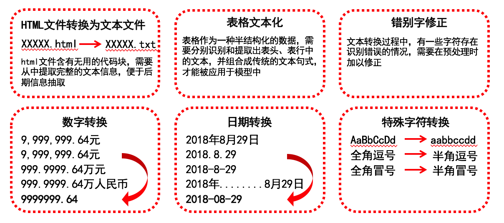
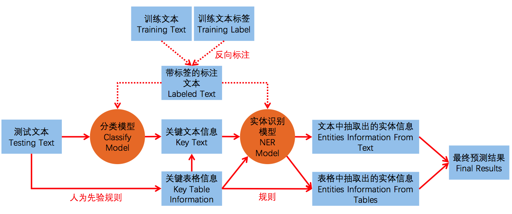
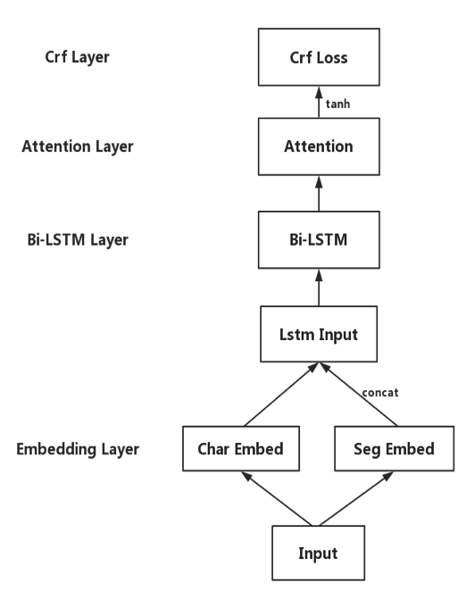

# FDDC2018金融算法挑战赛02--A股上市公司公告信息抽取--miyabi季军解决方案

#### 一、赛题简介

​        上市公司公告，是指上市公司按照证监会要求，通过指定平台向社会公众公布公司相关信息。在股市的投资研究过程中，上市公司的公告披露是投资者的重要参考依据，尤其对于专业的机构研究员，挖掘公告重要信息是每日投研的必要过程。但海量公告却令人脑难以负荷。我们将尝试让机器根据需求，自动抽取结构化数据，帮助研究员快速获取投资线索。

#### 二、数据特点

​        在正式开始做题之前，我们花了一些时间来观察数据，我们发现官方提供的训练数据以原始文本-最终结果的端到端形式给出，没有在原文中进行标注，同时文中字段和答案字段之间需要转化、公告中存在大量表格、pdf转html存在错误等。所以文本数据的预处理是本赛题一个较为重要的环节。这里特别说一下表格，表格是一种半结构化数据，经过特殊处理后甚至可以当做结构化数据使用，假如我们需要的信息较多分布在表格里的话，建议对表格做一些特殊处理，不要完全交给模型去做。

#### 三、数据预处理

​       数据预处理的目的主要有：通过html/pdf文件得到纯净文本，处理表格，格式化训练数据涉及到的字段和文本，用于反向标注等。我们的预处理模块主要如下图所示，比较简单易懂，不做过多赘述了。

#### 四、解决方案流程图

​      我们从预处理后的文本得到最终结果的流程图如下所示。

​        大体上可以分为训练和预测，两大部分。 训练部分，我们通过预处理之后的训练数据经过反向标注得到标注数据，根据标注数据分别训练出一个分类模型和一个实体识别模型。 预测部分，测试文本根据先验规则得到包含关键信息的表格文本。纯文本部分通过分类模型可以得到关键文本信息。关键文本信息和关键表格信息一起送入实体识别模型中得到关键实体，同时我在上面也讲到过，表格经过预处理是可以作为结构化数据使用的，一些简单的表格我们通过规则直接得到答案，配合模型抽取出来的实体经过一些规则组合得到最终的预测结果。 接下来着重讲解模型部分的选型和优化。

#### 五、算法方案：分类模型

​      由于上市公司报告的文本量非常大，且包含许多无关信息，对人而言数量庞大的文本量对模型而言也是一样的。所以我们想要通过一个简单的分类模型来选出包含关键信息的句子。由于我们认为该task比较简单，所以选用一个简单易用的模型直接达到我们的目标，否则会有本末倒置之感。我们选用的是facebook开源的fasttext模型，该模型可移植性好、训练和预测速度快。经过fasttext过滤之后，文本总量可以缩减30%-70%，使整体方案的准确性，尤其是运行速度都有提升。运行速度可以比使用全量文本直接进行抽取快50%左右。    顺带一提，这里的设计目的和冠军gogogo团队的文本精炼模块比较类似。只不过我们没有做过多的处理，采用的是一个简单分类模型，gogogo采用了html标签，文本位置等多个角度考虑。  融合两个方法应该会有更好的效率和结果。

#### 六、算法方案：实体识别模型

​      经过调研和实际的对比实验，我们最终使用的是lstm+crf+attention的模型。模型结构的示意图如下。

​        我们将所有字段都在原文中进行了分类别的标注。如甲方就标注为甲方、乙方标注为乙方。截止日期就标注为截止日期，相当于实体加分类都通过一个模型来做。所以没有采用多个模型来完成这件事（例如关系识别+实体识别）是因为我们也简单做了尝试。在这两种方案都不怎么调参和优化的情况下，用一个实体模型完成分类+识别的效果反而比关系识别+实体识别要稍微好一点，若是有足够的时间，这里还可以有更加精细的优化，如特征选择、模型结构、模型参数，以及多模型组合、融合等。   我们在答辩时注意到冠军亚军的队伍都没有对全部的字段都用模型来做，有一些较为简单、明显的字段，他们采用了正则、规则和枚举的方式，可以得到更好的结果，值得大家参考。

#### 七、方案效率与可扩展性

​      单线程的情况下，我们用本次竞赛篇幅最长的资产重组做测试。从预处理开始算，处理900篇文档需要3.1个小时，每篇需要12秒。而假如用篇幅最短的合同做测试，每篇只需要0.44秒，可以达到正常使用的要求。

​    扩展性方面说两点。一是方案扩展性，二是业务扩展性。对设计方案而言，我们的整体方案为模型增加特征、甚至替换模型等都较为方便，对系统模型而言有较好的可扩展性。对业务而言，我们的方案没有依赖正则等人工特征，换一类公告也是同样的处理流程就可以得到类似的结果，场景可扩展性较好。当然，要是为了更好地结果，人工特征是必要的，人工干预可以换来更好地落地结果相信也是实际生产环境中大家乐于看到的。

#### 八、一些总结

​        首先是提出了细致全面的文本预处理方法，设计了公告信息抽取任务的完整算法方案。其中使用分类模型过滤不相关信息的设计可以提高文本的信噪比，加速运行时间。最后采用双向lstm+att+crf的模型的方式来对关键实体进行抽取，得到了效率较高，扩展性强的解决方案。

​      说一些不足：

​      1、模型和方案力求简单，在模型结构的调整上，以及不同模型的组合上可以有更进一步的优化空间（例如关系抽取的应用，多模型ensemble等）。

​      2、虽然对表格做了一些特殊处理，不过时间因素还是有不少信息（上下文等）漏掉了，这里gogogo等团队有更好的处理。

​        3、力求处理方式的简便和方便，但是缺少了很多人工规则和正则，在真实生产环境中这种处理方法一般也不是较好的选择。例如一些字段，加入少量正则和规则         可能就有比模型好得多的表现，时间因素都没有加入。这里可以参照gogogo和Heisenberg的处理方法。

​    4、对某些字段理解还不太深刻，反向标注时也会标注到很多无关信息，若是有相关的专业人员来告诉技术人员一些经验（人工先验知识），优化标注方案，相         信效果会有不小的提升。

就说这个么多吧。方案较为粗糙，欢迎大家批评、指正。