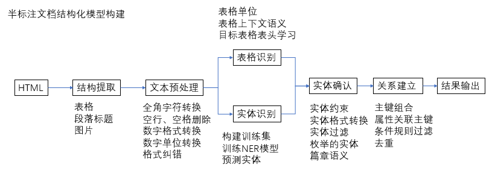
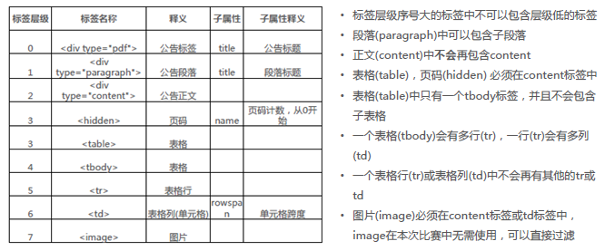
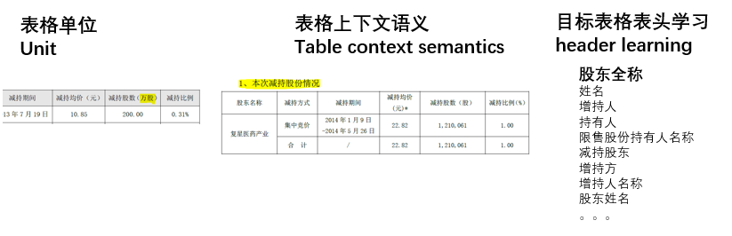
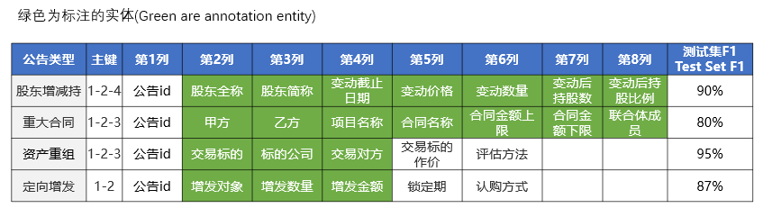
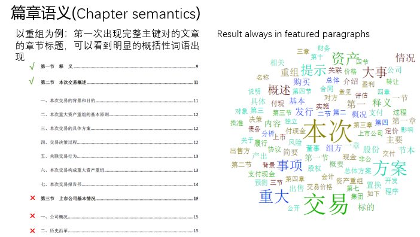

### FDDC2018金融算法挑战赛02—A股上市公司公告信息抽取—gogogo冠军解决方案

-----------------------------更新时间2018-9-7--------------------------------

## 一、整体流程

## 二、结构提取

本次采用的是从HTML文件开始，在提取过程种保留了HTML的文档的结构，主要是标题，层次结构，表格信息等。

工具(Tools)：Beautifulsoup

表格：表头识别、表格跨页合并、rowspan处理

段落标题：数字开头、内容矫正

图片：删除

## 三、文本预处理

全角字符转换：％ -> %

空行、空格删除：

数字格式转换：68,059,079股 -> 68059079

数字单位转换：合计金额不低于4亿元人民币 ->合计金额不低于 400000000元人民币

格式纠错：表格转换错误，语句非正常断句等（HTML转换问题）。

## 四、表格处理

这里要注意，表格的描述信息应该加入到表格的判断中来。

## 五、实体识别

1、训练集反向标注实体建立实体识别训练集

2、BiLSTM-CRF训练NER模型(Tensorflow)

3、调用模型预测实体

在标注的时候注意实体间的关系，主键需要在统一句话中才标注，其他属性与部分主键同时出现才标注，这样可以控制标注数据集的假阳性。

## 六、实体关系确认

1、实体约束：明确的规则，ref [round2] FDDC_announcements_submit_notice_20180806.pdf

2、实体格式转换：日期、数量、金额，顿号分割等

3、实体过滤：例如全称和简称的位置关系、交易标的和标的公司的位置关系等

4、枚举的实体：锁定期、评估方法、认购方式

5、缩写、指代

6、主键组合：同一个句子里面的实体组合主键

7、属性关联主键：主键与属性出现在同一个句子的进行组合

8、条件规则过滤：关键词匹配句子过滤

9、去重

## 七、模型优化

1、实体标注技巧(Entity annotation skills)：

​    按句子级别标注，同一个句子中包含所有主键则纳入训练集(primary key in one sentence)

​    简称、指代替换(full-short refer replacement)

​    信息损失，数字精度、日期简写(number precision、 date abbreviation)

2、奥卡姆剃刀：当公告结果只有一个主键时，其属性值不会产生歧义，往往属性不与主键在一个句子。

3、语义纠错：明显的单位错误，例如“万元”写成“元”，通过值域判断。

4、篇章语义：复杂文档会根据目录结构选择性阅读，而非整篇通读。

## 八、总结

在速度方面处理一篇公告都可以控制在秒级，大部分时间都耗费在NER上面，但NER模型建立的不大，而且通过篇章分析，大大降低了处理量。

因为时间关系，只完成了整个流程，还有许多中间步骤可以有更多模型可以代替，优化。

-----------------------------更新时间2018-9-1--------------------------------

赛题二因时间关系感觉还有很多提升空间，提供一些思路，供大家拍砖。

算法不细说，文本分类，实体识别，关系抽取这些算法可以尝试不同组合，不要妄想整篇文档喂给一个神经网络搞定，规则+神经网络是王道。

在缺乏完全有监督标注数据集的前提下可以用一些人读文档的顺序或习惯进行补充提高准确率。

列几个比较重要和容易忽视的地方：

1、文档的层次结构很重要，要保留，无论从HTML出发还是PDF，段落标题都是重要信息。

2、对表格描述的文字定义了表格中内容是否是我们需要的，可以建立单独分类器来判断或联合表头来判断表格是否是我们需要的。

3、因为实体没有标注到文档中，所以实体标注要基于主键关系联合标注，单独标注容易出现大量假阳性，人手或时间够的话用人工矫正一些，效果会更好。

4、读取信息的流程建议先读表格，然后读文字。

5、对于短篇文本，事件的上下文对事件判断起重要作用，对于长篇文本（如重组），段落标题也是决定事件语义的重要因素，很多地方都可以不用读，建有监督模型的话建议人工矫正一些。

6、这是一个完全工业的场景，数据清理少不了。

目前四个类型平均Fscore约为0.7，因为时间关系很多地方只搭了个架子没有用最优方案，估计做精细可以做到0.9以上。

欢迎拍砖，谢谢！